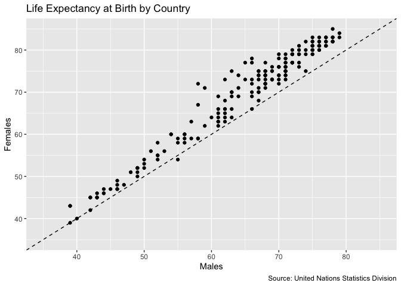

    ## 
    ## Attaching package: 'dplyr'

    ## The following objects are masked from 'package:stats':
    ## 
    ##     filter, lag

    ## The following objects are masked from 'package:base':
    ## 
    ##     intersect, setdiff, setequal, union

Global defaults
---------------

``` r
options(repr.plot.width = 6, repr.plot.height = 6)
```

Utility functions
-----------------

``` r
# TODO refactor this 
print_ln <- function() {
  cat(  "--------------------------------------------------------------------------------\n"  )
}
```

``` r
life_expectancy <- read.csv("../data/raw/UNdata_Export_20200411_102825637.csv", stringsAsFactors = FALSE)
```

``` r
subdata <- life_expectancy %>% 
  filter(Year=="2000-2005") %>%
  select(Country.or.Area, Subgroup, Value) %>%
  spread(Subgroup, Value)
```

``` r
  subdata %>%
  ggplot(aes(x = Male, y = Female)) +
  geom_point() 
```


``` r
  subdata %>%
  ggplot(aes(x = Male, y = Female)) +
  scale_x_continuous(limits=c(35,85)) +
  scale_y_continuous(limits=c(35,85)) +
  geom_point() + 
  geom_abline(slope = 1, intercept = 0, linetype = 2) + 
  xlab("Males") +
  ylab("Females") +
  labs(title = "Life Expectancy at Birth by Country", caption = "Source: United Nations Statistics Division")
```



``` r
top_male <- subdata %>% arrange(Male-Female) %>% head(3)
top_female <- subdata %>% arrange(Female-Male) %>% head(3)

ggplot(subdata, aes(x=Male, y=Female, label= Country.or.Area))+
  geom_point(colour="white", fill="chartreuse3", shape=21, alpha=.55, size=5)+
  geom_abline(intercept = 0, slope = 1, linetype=2)+
  geom_text(data=top_male, size=3)+
  geom_text(data=top_female, size=3)+
  theme_bw()+
  scale_x_continuous(limits=c(35,85))+
  scale_y_continuous(limits=c(35,85))+
  labs(title="Life Expectancy at Birth by Country",
       subtitle="Years. Period: 2000-2005. Average.",
       caption="Source: United Nations Statistics Division",
       x="Males",
       y="Females")
```


``` r
subdata2 <- life_expectancy %>% 
  filter(Year %in% c("1985-1990", "2000-2005")) %>% 
  mutate(Sub_Year=paste(Subgroup, Year, sep="_")) %>% 
  mutate(Sub_Year=gsub("-", "_", Sub_Year)) %>% 
  # the `~` is negation
  select(-Subgroup, -Year)  %>%
  spread(Sub_Year, Value) %>%
  mutate(diff_Female = Female_2000_2005 - Female_1985_1990, diff_Male = Male_2000_2005 - Male_1985_1990 )
```

``` r
ggplot(subdata2, aes(x= diff_Male, y=diff_Female, label=Country.or.Area))+
  geom_point(colour="white", fill="chartreuse3", shape=21, alpha=.55, size=5)+
  geom_abline(intercept = 0, slope = 1, linetype=2)+ 
  geom_hline(yintercept = 0, linetype=2)+
  geom_vline(xintercept = 0, linetype=2)+
  scale_x_continuous(limits=c(-25,25))+
  scale_y_continuous(limits=c(-25,25))+
  theme_bw()+
  labs(title="Life Expectancy at Birth by Country in Years",
       subtitle="Difference between 1985-1990 and 2000-2005. Average.",
       caption="Source: United Nations Statistics Division",
       x="Males",
       y="Females")
```


``` r
top <- subdata2 %>% arrange(diff_Male+diff_Female) %>% head(3)
bottom <- subdata2 %>% arrange(-(diff_Male+diff_Female)) %>% tail(3)

ggplot(subdata2, aes(x=diff_Male, y=diff_Female, label=Country.or.Area), guide=FALSE)+
  geom_point(colour="white", fill="chartreuse3", shape=21, alpha=.55, size=5)+
  geom_abline(intercept = 0, slope = 1, linetype=2)+
  scale_x_continuous(limits=c(-25,25))+
  scale_y_continuous(limits=c(-25,25))+
  geom_hline(yintercept=0, linetype=2)+
  geom_vline(xintercept=0, linetype=2)+
  labs(title="Life Expectancy at Birth by Country",
       subtitle="Years. Difference between 1985-1990 and 2000-2005. Average.",
       caption="Source: United Nations Statistics Division",
       x="Males",
       y="Females")+
  theme_bw()
```


